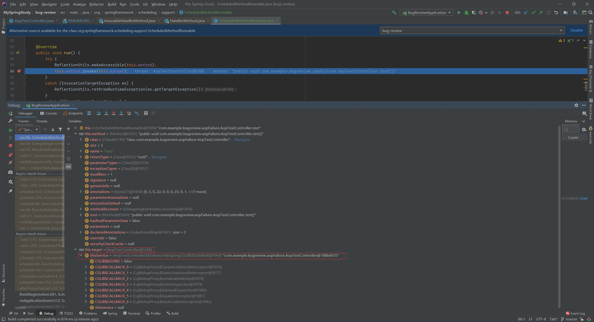
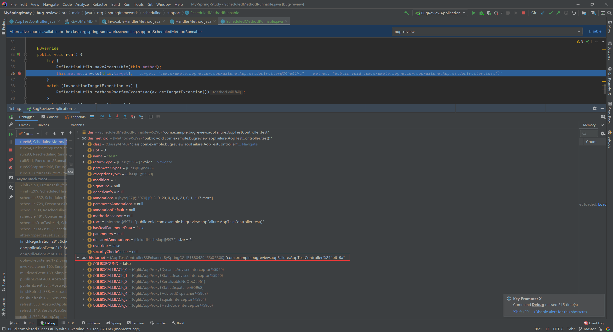
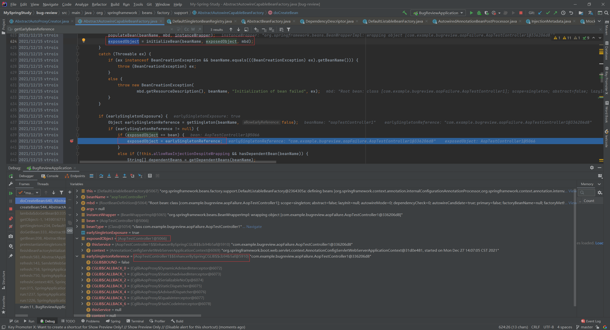
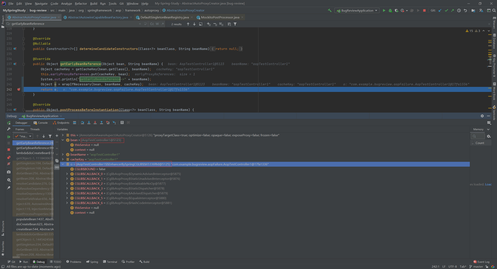

# 问题：AOP切面失效异常

## 代码展示

**切面类代码：**

```
@Retention(RetentionPolicy.RUNTIME)
@Target({ElementType.METHOD, ElementType.TYPE})
public @interface AopTest {
}
```

**切面类实现代码：**

```
@Aspect
@Component
@Slf4j
public class AopTestAspect {

    @Around(value = "@annotation(aopTest)")
    public void aspect(ProceedingJoinPoint point, AopTest aopTest) throws Throwable {
        log.info("--------------------aspect:{}-------------------------", point.getSignature().getName());
        point.proceed();
    }
}
```

**业务代码：**

```
@Slf4j
@RestController
@EnableScheduling
public class AopTestController {

    @Autowired
    private AopTestController aopTestController;

    @AopTest
    @Scheduled(cron = "0/10 * * * * ?")
    @GetMapping(value = "/aopTest")
    public void test() {
        log.info("-----------------------controller run------------");
        aopTestController.run();
    }

    public void run() {
        log.info("-------------method run--------------");
    }
}
```

## 问题

当使用http请求调用/aopTest，aop切面正常生效 <br/>
但当使用@Scheduled触发方法，aop切面失效

### 表层原因:

排查后发现，只要存在自己注入自己service的代码，就会导致这个问题：

```
    @Autowired
    private AopTestController aopTestController;
```

### 初级解决方案：

如果改为这种写法就可以避免出现@Scheduled下AOP失效的问题，这个时候无论是http还是@Scheduled，方法调用都可以被正常切面

```
    @Autowired
    private ApplicationContext context;

    @AopTest
    @Scheduled(cron = "0/10 * * * * ?")
    @GetMapping(value = "/aopTest")
    public void test() {
        log.info("-----------------------controller run------------");
        AopTestController aopTestController = context.getBean(this.getClass());
        aopTestController.run();
    }

    public void run() {
        log.info("-------------method run--------------");
    }
```

## 底层原因剖析

### 日志:

- @Scheduled 的调用链路（存在自己注入自己，AOP不生效）：

```
java.lang.RuntimeException: error
	at com.java.node.bug.scheduledAop.AopTestController.test(AopTestController.java:29) ~[classes/:na]
	at sun.reflect.NativeMethodAccessorImpl.invoke0(Native Method) ~[na:1.8.0_181]
	at sun.reflect.NativeMethodAccessorImpl.invoke(NativeMethodAccessorImpl.java:62) ~[na:1.8.0_181]
	at sun.reflect.DelegatingMethodAccessorImpl.invoke(DelegatingMethodAccessorImpl.java:43) ~[na:1.8.0_181]
	at java.lang.reflect.Method.invoke(Method.java:498) ~[na:1.8.0_181]
	at org.support.scheduling.org.springframework.ScheduledMethodRunnable.run(ScheduledMethodRunnable.java:84) ~[spring-context-5.0.8.RELEASE.jar:5.0.8.RELEASE]
	at org.springframework.scheduling.support.DelegatingErrorHandlingRunnable.run(DelegatingErrorHandlingRunnable.java:54) ~[spring-context-5.0.8.RELEASE.jar:5.0.8.RELEASE]
	at org.springframework.scheduling.concurrent.ReschedulingRunnable.run(ReschedulingRunnable.java:93) [spring-context-5.0.8.RELEASE.jar:5.0.8.RELEASE]
	at java.util.concurrent.Executors$RunnableAdapter.call(Executors.java:511) [na:1.8.0_181]
	at java.util.concurrent.FutureTask.run(FutureTask.java:266) [na:1.8.0_181]
	at java.util.concurrent.ScheduledThreadPoolExecutor$ScheduledFutureTask.access$201(ScheduledThreadPoolExecutor.java:180) [na:1.8.0_181]
	at java.util.concurrent.ScheduledThreadPoolExecutor$ScheduledFutureTask.run(ScheduledThreadPoolExecutor.java:293) [na:1.8.0_181]
	at java.util.concurrent.ThreadPoolExecutor.runWorker(ThreadPoolExecutor.java:1149) [na:1.8.0_181]
	at java.util.concurrent.ThreadPoolExecutor$Worker.run(ThreadPoolExecutor.java:624) [na:1.8.0_181]
	at java.lang.Thread.run(Thread.java:748) [na:1.8.0_181]
```

- @Scheduled 的调用链路（不存在自己注入自己，AOP生效）：

```
java.lang.RuntimeException: error
	at com.java.node.bug.scheduledAop.AopTestController.test(AopTestController.java:29) ~[classes/:na]
	at com.java.node.bug.scheduledAop.AopTestController$$FastClassBySpringCGLIB$$5c47edfd.invoke(<generated>) ~[classes/:na]
	at org.springframework.cglib.proxy.MethodProxy.invoke(MethodProxy.java:204) ~[spring-core-5.0.8.RELEASE.jar:5.0.8.RELEASE]
	at org.springframework.aop.framework.CglibAopProxy$CglibMethodInvocation.invokeJoinpoint(CglibAopProxy.java:746) ~[spring-aop-5.0.8.RELEASE.jar:5.0.8.RELEASE]
	at org.springframework.aop.framework.ReflectiveMethodInvocation.proceed(ReflectiveMethodInvocation.java:163) ~[spring-aop-5.0.8.RELEASE.jar:5.0.8.RELEASE]
	at org.springframework.aop.aspectj.MethodInvocationProceedingJoinPoint.proceed(MethodInvocationProceedingJoinPoint.java:88) ~[spring-aop-5.0.8.RELEASE.jar:5.0.8.RELEASE]
	at com.java.node.bug.scheduledAop.AopTestAspect.aspect(AopTestAspect.java:25) ~[classes/:na]
	at sun.reflect.NativeMethodAccessorImpl.invoke0(Native Method) ~[na:1.8.0_181]
	at sun.reflect.NativeMethodAccessorImpl.invoke(NativeMethodAccessorImpl.java:62) ~[na:1.8.0_181]
	at sun.reflect.DelegatingMethodAccessorImpl.invoke(DelegatingMethodAccessorImpl.java:43) ~[na:1.8.0_181]
	at java.lang.reflect.Method.invoke(Method.java:498) ~[na:1.8.0_181]
	at org.springframework.aop.aspectj.AbstractAspectJAdvice.invokeAdviceMethodWithGivenArgs(AbstractAspectJAdvice.java:644) ~[spring-aop-5.0.8.RELEASE.jar:5.0.8.RELEASE]
	at org.springframework.aop.aspectj.AbstractAspectJAdvice.invokeAdviceMethod(AbstractAspectJAdvice.java:633) ~[spring-aop-5.0.8.RELEASE.jar:5.0.8.RELEASE]
	at org.springframework.aop.aspectj.AspectJAroundAdvice.invoke(AspectJAroundAdvice.java:70) ~[spring-aop-5.0.8.RELEASE.jar:5.0.8.RELEASE]
	at org.springframework.aop.framework.ReflectiveMethodInvocation.proceed(ReflectiveMethodInvocation.java:174) ~[spring-aop-5.0.8.RELEASE.jar:5.0.8.RELEASE]
	at org.springframework.aop.interceptor.ExposeInvocationInterceptor.invoke(ExposeInvocationInterceptor.java:92) ~[spring-aop-5.0.8.RELEASE.jar:5.0.8.RELEASE]
	at org.springframework.aop.framework.ReflectiveMethodInvocation.proceed(ReflectiveMethodInvocation.java:185) ~[spring-aop-5.0.8.RELEASE.jar:5.0.8.RELEASE]
	at org.springframework.aop.framework.CglibAopProxy$DynamicAdvisedInterceptor.intercept(CglibAopProxy.java:688) ~[spring-aop-5.0.8.RELEASE.jar:5.0.8.RELEASE]
	at com.java.node.bug.scheduledAop.AopTestController$$EnhancerBySpringCGLIB$$5699caf4.test(<generated>) ~[classes/:na]
	at sun.reflect.NativeMethodAccessorImpl.invoke0(Native Method) ~[na:1.8.0_181]
	at sun.reflect.NativeMethodAccessorImpl.invoke(NativeMethodAccessorImpl.java:62) ~[na:1.8.0_181]
	at sun.reflect.DelegatingMethodAccessorImpl.invoke(DelegatingMethodAccessorImpl.java:43) ~[na:1.8.0_181]
	at java.lang.reflect.Method.invoke(Method.java:498) ~[na:1.8.0_181]
	at org.support.scheduling.org.springframework.ScheduledMethodRunnable.run(ScheduledMethodRunnable.java:84) ~[spring-context-5.0.8.RELEASE.jar:5.0.8.RELEASE]
	at org.springframework.scheduling.support.DelegatingErrorHandlingRunnable.run(DelegatingErrorHandlingRunnable.java:54) ~[spring-context-5.0.8.RELEASE.jar:5.0.8.RELEASE]
	at org.springframework.scheduling.concurrent.ReschedulingRunnable.run(ReschedulingRunnable.java:93) [spring-context-5.0.8.RELEASE.jar:5.0.8.RELEASE]
	at java.util.concurrent.Executors$RunnableAdapter.call(Executors.java:511) [na:1.8.0_181]
	at java.util.concurrent.FutureTask.run(FutureTask.java:266) [na:1.8.0_181]
	at java.util.concurrent.ScheduledThreadPoolExecutor$ScheduledFutureTask.access$201(ScheduledThreadPoolExecutor.java:180) [na:1.8.0_181]
	at java.util.concurrent.ScheduledThreadPoolExecutor$ScheduledFutureTask.run(ScheduledThreadPoolExecutor.java:293) [na:1.8.0_181]
	at java.util.concurrent.ThreadPoolExecutor.runWorker(ThreadPoolExecutor.java:1149) [na:1.8.0_181]
	at java.util.concurrent.ThreadPoolExecutor$Worker.run(ThreadPoolExecutor.java:624) [na:1.8.0_181]
	at java.lang.Thread.run(Thread.java:748) [na:1.8.0_181]
```

- http的调用链路（自己注入自己，无论存不存在，日志都一样，且AOP都生效)

```
java.lang.RuntimeException: error
	at com.java.node.bug.scheduledAop.AopTestController.test(AopTestController.java:29) ~[classes/:na]
	at com.java.node.bug.scheduledAop.AopTestController$$FastClassBySpringCGLIB$$5c47edfd.invoke(<generated>) ~[classes/:na]
	at org.springframework.cglib.proxy.MethodProxy.invoke(MethodProxy.java:204) ~[spring-core-5.0.8.RELEASE.jar:5.0.8.RELEASE]
	at org.springframework.aop.framework.CglibAopProxy$CglibMethodInvocation.invokeJoinpoint(CglibAopProxy.java:746) ~[spring-aop-5.0.8.RELEASE.jar:5.0.8.RELEASE]
	at org.springframework.aop.framework.ReflectiveMethodInvocation.proceed(ReflectiveMethodInvocation.java:163) ~[spring-aop-5.0.8.RELEASE.jar:5.0.8.RELEASE]
	at org.springframework.aop.aspectj.MethodInvocationProceedingJoinPoint.proceed(MethodInvocationProceedingJoinPoint.java:88) ~[spring-aop-5.0.8.RELEASE.jar:5.0.8.RELEASE]
	at com.java.node.bug.scheduledAop.AopTestAspect.aspect(AopTestAspect.java:25) ~[classes/:na]
	at sun.reflect.NativeMethodAccessorImpl.invoke0(Native Method) ~[na:1.8.0_181]
	at sun.reflect.NativeMethodAccessorImpl.invoke(NativeMethodAccessorImpl.java:62) ~[na:1.8.0_181]
	at sun.reflect.DelegatingMethodAccessorImpl.invoke(DelegatingMethodAccessorImpl.java:43) ~[na:1.8.0_181]
	at java.lang.reflect.Method.invoke(Method.java:498) ~[na:1.8.0_181]
	at org.springframework.aop.aspectj.AbstractAspectJAdvice.invokeAdviceMethodWithGivenArgs(AbstractAspectJAdvice.java:644) ~[spring-aop-5.0.8.RELEASE.jar:5.0.8.RELEASE]
	at org.springframework.aop.aspectj.AbstractAspectJAdvice.invokeAdviceMethod(AbstractAspectJAdvice.java:633) ~[spring-aop-5.0.8.RELEASE.jar:5.0.8.RELEASE]
	at org.springframework.aop.aspectj.AspectJAroundAdvice.invoke(AspectJAroundAdvice.java:70) ~[spring-aop-5.0.8.RELEASE.jar:5.0.8.RELEASE]
	at org.springframework.aop.framework.ReflectiveMethodInvocation.proceed(ReflectiveMethodInvocation.java:174) ~[spring-aop-5.0.8.RELEASE.jar:5.0.8.RELEASE]
	at org.springframework.aop.interceptor.ExposeInvocationInterceptor.invoke(ExposeInvocationInterceptor.java:92) ~[spring-aop-5.0.8.RELEASE.jar:5.0.8.RELEASE]
	at org.springframework.aop.framework.ReflectiveMethodInvocation.proceed(ReflectiveMethodInvocation.java:185) ~[spring-aop-5.0.8.RELEASE.jar:5.0.8.RELEASE]
	at org.springframework.aop.framework.CglibAopProxy$DynamicAdvisedInterceptor.intercept(CglibAopProxy.java:688) ~[spring-aop-5.0.8.RELEASE.jar:5.0.8.RELEASE]
	at com.java.node.bug.scheduledAop.AopTestController$$EnhancerBySpringCGLIB$$1438f6b5.test(<generated>) ~[classes/:na]
	at sun.reflect.NativeMethodAccessorImpl.invoke0(Native Method) ~[na:1.8.0_181]
	at sun.reflect.NativeMethodAccessorImpl.invoke(NativeMethodAccessorImpl.java:62) ~[na:1.8.0_181]
	at sun.reflect.DelegatingMethodAccessorImpl.invoke(DelegatingMethodAccessorImpl.java:43) ~[na:1.8.0_181]
	at java.lang.reflect.Method.invoke(Method.java:498) ~[na:1.8.0_181]
	at org.springframework.web.method.support.InvocableHandlerMethod.doInvoke(InvocableHandlerMethod.java:209) ~[spring-web-5.0.8.RELEASE.jar:5.0.8.RELEASE]
	at org.springframework.web.method.support.InvocableHandlerMethod.invokeForRequest(InvocableHandlerMethod.java:136) ~[spring-web-5.0.8.RELEASE.jar:5.0.8.RELEASE]
	at org.springframework.web.servlet.mvc.method.annotation.ServletInvocableHandlerMethod.invokeAndHandle(ServletInvocableHandlerMethod.java:102) ~[spring-webmvc-5.0.8.RELEASE.jar:5.0.8.RELEASE]
	at org.springframework.web.servlet.mvc.method.annotation.RequestMappingHandlerAdapter.invokeHandlerMethod(RequestMappingHandlerAdapter.java:877) ~[spring-webmvc-5.0.8.RELEASE.jar:5.0.8.RELEASE]
	at org.springframework.web.servlet.mvc.method.annotation.RequestMappingHandlerAdapter.handleInternal(RequestMappingHandlerAdapter.java:783) ~[spring-webmvc-5.0.8.RELEASE.jar:5.0.8.RELEASE]
	at org.springframework.web.servlet.mvc.method.AbstractHandlerMethodAdapter.handle(AbstractHandlerMethodAdapter.java:87) ~[spring-webmvc-5.0.8.RELEASE.jar:5.0.8.RELEASE]
	at org.springframework.web.servlet.DispatcherServlet.doDispatch(DispatcherServlet.java:991) ~[spring-webmvc-5.0.8.RELEASE.jar:5.0.8.RELEASE]
	at org.springframework.web.servlet.DispatcherServlet.doService(DispatcherServlet.java:925) ~[spring-webmvc-5.0.8.RELEASE.jar:5.0.8.RELEASE]
	at org.springframework.web.servlet.FrameworkServlet.processRequest(FrameworkServlet.java:974) ~[spring-webmvc-5.0.8.RELEASE.jar:5.0.8.RELEASE]
	at org.springframework.web.servlet.FrameworkServlet.doGet(FrameworkServlet.java:866) ~[spring-webmvc-5.0.8.RELEASE.jar:5.0.8.RELEASE]
	at javax.servlet.http.HttpServlet.service(HttpServlet.java:635) ~[tomcat-embed-core-8.5.32.jar:8.5.32]
	at org.springframework.web.servlet.FrameworkServlet.service(FrameworkServlet.java:851) ~[spring-webmvc-5.0.8.RELEASE.jar:5.0.8.RELEASE]
	at javax.servlet.http.HttpServlet.service(HttpServlet.java:742) ~[tomcat-embed-core-8.5.32.jar:8.5.32]
	at org.apache.catalina.core.ApplicationFilterChain.internalDoFilter(ApplicationFilterChain.java:231) ~[tomcat-embed-core-8.5.32.jar:8.5.32]
	at org.apache.catalina.core.ApplicationFilterChain.doFilter(ApplicationFilterChain.java:166) ~[tomcat-embed-core-8.5.32.jar:8.5.32]
	at org.springframework.web.filter.RequestContextFilter.doFilterInternal(RequestContextFilter.java:99) ~[spring-web-5.0.8.RELEASE.jar:5.0.8.RELEASE]
	at org.springframework.web.filter.OncePerRequestFilter.doFilter(OncePerRequestFilter.java:107) ~[spring-web-5.0.8.RELEASE.jar:5.0.8.RELEASE]
	at org.apache.catalina.core.ApplicationFilterChain.internalDoFilter(ApplicationFilterChain.java:193) ~[tomcat-embed-core-8.5.32.jar:8.5.32]
	at org.apache.catalina.core.ApplicationFilterChain.doFilter(ApplicationFilterChain.java:166) ~[tomcat-embed-core-8.5.32.jar:8.5.32]
	at org.springframework.web.filter.HttpPutFormContentFilter.doFilterInternal(HttpPutFormContentFilter.java:109) ~[spring-web-5.0.8.RELEASE.jar:5.0.8.RELEASE]
	at org.springframework.web.filter.OncePerRequestFilter.doFilter(OncePerRequestFilter.java:107) ~[spring-web-5.0.8.RELEASE.jar:5.0.8.RELEASE]
	at org.apache.catalina.core.ApplicationFilterChain.internalDoFilter(ApplicationFilterChain.java:193) ~[tomcat-embed-core-8.5.32.jar:8.5.32]
	at org.apache.catalina.core.ApplicationFilterChain.doFilter(ApplicationFilterChain.java:166) ~[tomcat-embed-core-8.5.32.jar:8.5.32]
	at org.springframework.web.filter.HiddenHttpMethodFilter.doFilterInternal(HiddenHttpMethodFilter.java:93) ~[spring-web-5.0.8.RELEASE.jar:5.0.8.RELEASE]
	at org.springframework.web.filter.OncePerRequestFilter.doFilter(OncePerRequestFilter.java:107) ~[spring-web-5.0.8.RELEASE.jar:5.0.8.RELEASE]
	at org.apache.catalina.core.ApplicationFilterChain.internalDoFilter(ApplicationFilterChain.java:193) ~[tomcat-embed-core-8.5.32.jar:8.5.32]
	at org.apache.catalina.core.ApplicationFilterChain.doFilter(ApplicationFilterChain.java:166) ~[tomcat-embed-core-8.5.32.jar:8.5.32]
	at org.springframework.web.filter.CharacterEncodingFilter.doFilterInternal(CharacterEncodingFilter.java:200) ~[spring-web-5.0.8.RELEASE.jar:5.0.8.RELEASE]
	at org.springframework.web.filter.OncePerRequestFilter.doFilter(OncePerRequestFilter.java:107) ~[spring-web-5.0.8.RELEASE.jar:5.0.8.RELEASE]
	at org.apache.catalina.core.ApplicationFilterChain.internalDoFilter(ApplicationFilterChain.java:193) ~[tomcat-embed-core-8.5.32.jar:8.5.32]
	at org.apache.catalina.core.ApplicationFilterChain.doFilter(ApplicationFilterChain.java:166) ~[tomcat-embed-core-8.5.32.jar:8.5.32]
	at org.apache.catalina.core.StandardWrapperValve.invoke(StandardWrapperValve.java:198) ~[tomcat-embed-core-8.5.32.jar:8.5.32]
	at org.apache.catalina.core.StandardContextValve.invoke(StandardContextValve.java:96) [tomcat-embed-core-8.5.32.jar:8.5.32]
	at org.apache.catalina.authenticator.AuthenticatorBase.invoke(AuthenticatorBase.java:493) [tomcat-embed-core-8.5.32.jar:8.5.32]
	at org.apache.catalina.core.StandardHostValve.invoke(StandardHostValve.java:140) [tomcat-embed-core-8.5.32.jar:8.5.32]
	at org.apache.catalina.valves.ErrorReportValve.invoke(ErrorReportValve.java:81) [tomcat-embed-core-8.5.32.jar:8.5.32]
	at org.apache.catalina.core.StandardEngineValve.invoke(StandardEngineValve.java:87) [tomcat-embed-core-8.5.32.jar:8.5.32]
	at org.apache.catalina.connector.CoyoteAdapter.service(CoyoteAdapter.java:342) [tomcat-embed-core-8.5.32.jar:8.5.32]
	at org.apache.coyote.http11.Http11Processor.service(Http11Processor.java:800) [tomcat-embed-core-8.5.32.jar:8.5.32]
	at org.apache.coyote.AbstractProcessorLight.process(AbstractProcessorLight.java:66) [tomcat-embed-core-8.5.32.jar:8.5.32]
	at org.apache.coyote.AbstractProtocol$ConnectionHandler.process(AbstractProtocol.java:800) [tomcat-embed-core-8.5.32.jar:8.5.32]
	at org.apache.tomcat.util.net.NioEndpoint$SocketProcessor.doRun(NioEndpoint.java:1471) [tomcat-embed-core-8.5.32.jar:8.5.32]
	at org.apache.tomcat.util.net.SocketProcessorBase.run(SocketProcessorBase.java:49) [tomcat-embed-core-8.5.32.jar:8.5.32]
	at java.util.concurrent.ThreadPoolExecutor.runWorker(ThreadPoolExecutor.java:1149) [na:1.8.0_181]
	at java.util.concurrent.ThreadPoolExecutor$Worker.run(ThreadPoolExecutor.java:624) [na:1.8.0_181]
	at org.apache.tomcat.util.threads.TaskThread$WrappingRunnable.run(TaskThread.java:61) [tomcat-embed-core-8.5.32.jar:8.5.32]
	at java.lang.Thread.run(Thread.java:748) [na:1.8.0_181]
```

### 原因猜测

最初还没有看日志时，猜测是因为当存在自己注入自己的时候，AOP切面的代码某处判断给忽略了，导致没有正常的走切面代码

但后来打印了调用链路日志时发现，出现bug时压根就没有走AOP的相关代码。那么问题就应该是在Sping项目创建的时候加载bean，因为自己注入自己导致加载的bean有问题，导致invoke后续没有正常的调用AOP相关代码。

至于为什么http时可以正常的走aop代码，而@Scheduled不行，应该是因为两者触发方法的方式不一致，导致@Scheduled才会有这个bug，但目前并没有找到相关证据支持此猜测

## 排查过程

仔细的看过了调用链路后，在各个地方打断点看了下信息，终于在调用JDK源码的invoke处找到了端倪

```
	at org.support.scheduling.org.springframework.ScheduledMethodRunnable.run(ScheduledMethodRunnable.java:84)
```

###Scheduled的AOP失效的

###Scheduled的AOP生效的


可以看到有问题的target（这个target也是这个controller的bean对象）是没有被Spring代理到的，他的名字就是普通的类名，而下面的自己注入自己的bean反而是被一个被spring代理的bean对象，所以下一步就是找到这个有问题的bean对象是怎么生成的了 <br/>
那么问题来了，既然spring在这里给传了个有问题的bean，然后Scheduled存储了这个有问题的bean导致了后续的问题。那为什么后面Spring调用HTTP的时候用的bean是没问题的，所以原因肯定是因为后续Spring对这个bean做了处理

首先重写了ScheduledMethodRunnable.java的代码后，在初始化target的时候抛了个异常，获得了下面的调用链路，然后仔细排查后，找到了重置bean为正确的地方

```

org.springframework.beans.factory.BeanCreationException: Error creating bean with name 'aopTestController' defined in file []: Initialization of bean failed; nested exception is java.lang.RuntimeException: error
	at org.springframework.beans.factory.support.AbstractAutowireCapableBeanFactory.doCreateBean(AbstractAutowireCapableBeanFactory.java:581) ~[spring-beans-5.0.8.RELEASE.jar:5.0.8.RELEASE]
	at org.springframework.beans.factory.support.AbstractAutowireCapableBeanFactory.createBean(AbstractAutowireCapableBeanFactory.java:495) ~[spring-beans-5.0.8.RELEASE.jar:5.0.8.RELEASE]
	at org.springframework.beans.factory.support.AbstractBeanFactory.lambda$doGetBean$0(AbstractBeanFactory.java:317) ~[spring-beans-5.0.8.RELEASE.jar:5.0.8.RELEASE]
	at org.springframework.beans.factory.support.DefaultSingletonBeanRegistry.getSingleton(DefaultSingletonBeanRegistry.java:222) ~[spring-beans-5.0.8.RELEASE.jar:5.0.8.RELEASE]
	at org.springframework.beans.factory.support.AbstractBeanFactory.doGetBean(AbstractBeanFactory.java:315) ~[spring-beans-5.0.8.RELEASE.jar:5.0.8.RELEASE]
	at org.springframework.beans.factory.support.AbstractBeanFactory.getBean(AbstractBeanFactory.java:199) ~[spring-beans-5.0.8.RELEASE.jar:5.0.8.RELEASE]
	at org.springframework.beans.factory.support.DefaultListableBeanFactory.preInstantiateSingletons(DefaultListableBeanFactory.java:759) ~[spring-beans-5.0.8.RELEASE.jar:5.0.8.RELEASE]
	at org.springframework.context.support.AbstractApplicationContext.finishBeanFactoryInitialization(AbstractApplicationContext.java:869) ~[spring-context-5.0.8.RELEASE.jar:5.0.8.RELEASE]
	at org.springframework.context.support.AbstractApplicationContext.refresh(AbstractApplicationContext.java:550) ~[spring-context-5.0.8.RELEASE.jar:5.0.8.RELEASE]
	at org.springframework.boot.web.servlet.context.ServletWebServerApplicationContext.refresh(ServletWebServerApplicationContext.java:140) ~[spring-boot-2.0.4.RELEASE.jar:2.0.4.RELEASE]
	at org.springframework.boot.SpringApplication.refresh(SpringApplication.java:762) [spring-boot-2.0.4.RELEASE.jar:2.0.4.RELEASE]
	at org.springframework.boot.SpringApplication.refreshContext(SpringApplication.java:398) [spring-boot-2.0.4.RELEASE.jar:2.0.4.RELEASE]
	at org.springframework.boot.SpringApplication.run(SpringApplication.java:330) [spring-boot-2.0.4.RELEASE.jar:2.0.4.RELEASE]
	at org.springframework.boot.SpringApplication.run(SpringApplication.java:1258) [spring-boot-2.0.4.RELEASE.jar:2.0.4.RELEASE]
	at org.springframework.boot.SpringApplication.run(SpringApplication.java:1246) [spring-boot-2.0.4.RELEASE.jar:2.0.4.RELEASE]
	at com.java.node.bug.BugScheduledAopApplication.main(BugReviewApplication.java:11) [classes/:na]
Caused by: java.lang.RuntimeException: error
	at org.support.scheduling.org.springframework.ScheduledMethodRunnable.<init>(ScheduledMethodRunnable.java:52) ~[classes/:na]
	at org.annotation.scheduling.org.springframework.ScheduledAnnotationBeanPostProcessor.processScheduled(ScheduledAnnotationBeanPostProcessor.java:350) ~[classes/:5.0.8.RELEASE]
	at org.annotation.scheduling.org.springframework.ScheduledAnnotationBeanPostProcessor.lambda$null$1(ScheduledAnnotationBeanPostProcessor.java:334) ~[classes/:5.0.8.RELEASE]
	at java.lang.Iterable.forEach(Iterable.java:75) ~[na:1.8.0_181]
	at org.annotation.scheduling.org.springframework.ScheduledAnnotationBeanPostProcessor.lambda$postProcessAfterInitialization$2(ScheduledAnnotationBeanPostProcessor.java:334) ~[classes/:5.0.8.RELEASE]
	at java.util.LinkedHashMap.forEach(LinkedHashMap.java:684) ~[na:1.8.0_181]
	这一行是Spring设计的bean的接口，Scheduled实现了这个接口，这个接口应该是Spring设计的用于第三方框架调整bean内容的
	at org.annotation.scheduling.org.springframework.ScheduledAnnotationBeanPostProcessor.postProcessAfterInitialization(ScheduledAnnotationBeanPostProcessor.java:333) ~[classes/:5.0.8.RELEASE]
	at org.springframework.beans.factory.support.AbstractAutowireCapableBeanFactory.applyBeanPostProcessorsAfterInitialization(AbstractAutowireCapableBeanFactory.java:431) ~[spring-beans-5.0.8.RELEASE.jar:5.0.8.RELEASE]
	at org.springframework.beans.factory.support.AbstractAutowireCapableBeanFactory.initializeBean(AbstractAutowireCapableBeanFactory.java:1703) ~[spring-beans-5.0.8.RELEASE.jar:5.0.8.RELEASE]
	上一行，也就是initializeBean()方法返回的bean还是有问题的bean,但被doCreateBean()方法的后续处理给改成了正确的
	at org.springframework.beans.factory.support.AbstractAutowireCapableBeanFactory.doCreateBean(AbstractAutowireCapableBeanFactory.java:573) ~[spring-beans-5.0.8.RELEASE.jar:5.0.8.RELEASE]
	... 15 common frames omitted
```

### 重置bean为之前的地方,第一处返回了问题Bean，第二处改成了正确bean



在问过朋友后，得知类名的**

$$
EnhancerBySpringCGLIB
$$

** 是指被aop框架的CGLIB代理增强了，加上了切面方法，所以才会在调用这个类的方法时会走aop切面

而调用aop框架进行CGLIB增加的代码在这里：

```java
public abstract class AbstractAutowireCapableBeanFactory extends AbstractBeanFactory
        implements AutowireCapableBeanFactory {
    @Override
    public Object applyBeanPostProcessorsAfterInitialization(Object existingBean, String beanName)
            throws BeansException {
        Object result = existingBean;
        for (BeanPostProcessor processor : getBeanPostProcessors()) {
            //这里是调用各个自定义的bean后置处理，spring启动后，分别走了下面的bean处理器，其中第六个便是aop处理
            Object current = processor.postProcessAfterInitialization(result, beanName);
            if (current == null) {
                return result;
            }
            result = current;
        }
        return result;
    }
}

```

```
class org.springframework.context.support.ApplicationContextAwareProcessor
class org.springframework.boot.web.servlet.context.WebApplicationContextServletContextAwareProcessor
class org.springframework.context.annotation.ConfigurationClassPostProcessor$ImportAwareBeanPostProcessor
class org.springframework.context.support.PostProcessorRegistrationDelegate$BeanPostProcessorChecker
class org.springframework.boot.context.properties.ConfigurationPropertiesBindingPostProcessor
//这一个
class org.springframework.aop.aspectj.annotation.AnnotationAwareAspectJAutoProxyCreator
class org.springframework.boot.web.server.WebServerFactoryCustomizerBeanPostProcessor
class org.springframework.boot.web.server.ErrorPageRegistrarBeanPostProcessor
class org.springframework.context.annotation.CommonAnnotationBeanPostProcessor
class org.springframework.beans.factory.annotation.AutowiredAnnotationBeanPostProcessor
class org.annotation.scheduling.org.springframework.ScheduledAnnotationBeanPostProcessor
class org.springframework.context.support.ApplicationListenerDetector
class org.springframework.context.support.ApplicationContextAwareProcessor
class org.springframework.boot.web.servlet.context.WebApplicationContextServletContextAwareProcessor
class org.springframework.context.annotation.ConfigurationClassPostProcessor$ImportAwareBeanPostProcessor
class org.springframework.context.support.PostProcessorRegistrationDelegate$BeanPostProcessorChecker
class org.springframework.boot.context.properties.ConfigurationPropertiesBindingPostProcessor
class org.springframework.aop.aspectj.annotation.AnnotationAwareAspectJAutoProxyCreator
class org.springframework.boot.web.server.WebServerFactoryCustomizerBeanPostProcessor
class org.springframework.boot.web.server.ErrorPageRegistrarBeanPostProcessor
class org.springframework.context.annotation.CommonAnnotationBeanPostProcessor
class org.springframework.beans.factory.annotation.AutowiredAnnotationBeanPostProcessor
class org.annotation.scheduling.org.springframework.ScheduledAnnotationBeanPostProcessor
class org.springframework.context.support.ApplicationListenerDetector
```

研究了下调用AOP的CGLIB代理的链路，发现存在自己注入自己的循环依赖，和没有的，CGLIB的调用地方不一样

###存在循环依赖的

```
    at org.autoproxy.framework.aop.org.springframework.AbstractAutoProxyCreator.createProxy(AbstractAutoProxyCreator.java:437)
    //这一步给aopTestController的内部的自己注入自己的aopTestController加上了CGLIB增强代理
    at org.autoproxy.framework.aop.org.springframework.AbstractAutoProxyCreator.wrapIfNecessary(AbstractAutoProxyCreator.java:340)
    at org.autoproxy.framework.aop.org.springframework.AbstractAutoProxyCreator.getEarlyBeanReference(AbstractAutoProxyCreator.java:240)
    at org.springframework.beans.factory.support.AbstractAutowireCapableBeanFactory.getEarlyBeanReference(AbstractAutowireCapableBeanFactory.java:992)
    at org.springframework.beans.factory.support.AbstractAutowireCapableBeanFactory.lambda$doCreateBean$1(AbstractAutowireCapableBeanFactory.java:618)
    at org.springframework.beans.factory.support.DefaultSingletonBeanRegistry.getSingleton(DefaultSingletonBeanRegistry.java:194)
    at org.springframework.beans.factory.support.DefaultSingletonBeanRegistry.getSingleton(DefaultSingletonBeanRegistry.java:168)
    at org.springframework.beans.factory.support.AbstractBeanFactory.doGetBean(AbstractBeanFactory.java:256)
    at org.springframework.beans.factory.support.AbstractBeanFactory.getBean(AbstractBeanFactory.java:208)
    at org.springframework.beans.factory.config.DependencyDescriptor.resolveCandidate(DependencyDescriptor.java:276)
    at org.springframework.beans.factory.support.DefaultListableBeanFactory.doResolveDependency(DefaultListableBeanFactory.java:1380)
    at org.springframework.beans.factory.support.DefaultListableBeanFactory.resolveDependency(DefaultListableBeanFactory.java:1300)
    at org.springframework.beans.factory.annotation.AutowiredAnnotationBeanPostProcessor$AutowiredFieldElement.resolveFieldValue(AutowiredAnnotationBeanPostProcessor.java:656)
    at org.springframework.beans.factory.annotation.AutowiredAnnotationBeanPostProcessor$AutowiredFieldElement.inject(AutowiredAnnotationBeanPostProcessor.java:639)
    at org.springframework.beans.factory.annotation.InjectionMetadata.inject(InjectionMetadata.java:119)
    at org.springframework.beans.factory.annotation.AutowiredAnnotationBeanPostProcessor.postProcessProperties(AutowiredAnnotationBeanPostProcessor.java:399)
    //不同点
    at org.springframework.beans.factory.support.AbstractAutowireCapableBeanFactory.populateBean(AbstractAutowireCapableBeanFactory.java:1438)
    at org.springframework.beans.factory.support.AbstractAutowireCapableBeanFactory.doCreateBean(AbstractAutowireCapableBeanFactory.java:626)
    at org.springframework.beans.factory.support.AbstractAutowireCapableBeanFactory.createBean(AbstractAutowireCapableBeanFactory.java:547)
    at org.springframework.beans.factory.support.AbstractBeanFactory.lambda$doGetBean$0(AbstractBeanFactory.java:335)
    at org.springframework.beans.factory.support.DefaultSingletonBeanRegistry.getSingleton(DefaultSingletonBeanRegistry.java:234)
    at org.springframework.beans.factory.support.AbstractBeanFactory.doGetBean(AbstractBeanFactory.java:333)
```

###不存在循环依赖的

```
    at org.autoproxy.framework.aop.org.springframework.AbstractAutoProxyCreator.createProxy(AbstractAutoProxyCreator.java:437)
    at org.autoproxy.framework.aop.org.springframework.AbstractAutoProxyCreator.wrapIfNecessary(AbstractAutoProxyCreator.java:340)
    //存在循环依赖的，走到这个方法的时候，没有过这个判断 if (this.earlyProxyReferences.remove(cacheKey) != bean)  因此没有给其外层加上CGLIB代理
    at org.autoproxy.framework.aop.org.springframework.AbstractAutoProxyCreator.postProcessAfterInitialization(AbstractAutoProxyCreator.java:289)
    at org.springframework.beans.factory.support.AbstractAutowireCapableBeanFactory.applyBeanPostProcessorsAfterInitialization(AbstractAutowireCapableBeanFactory.java:460)
    //不同点
    at org.springframework.beans.factory.support.AbstractAutowireCapableBeanFactory.initializeBean(AbstractAutowireCapableBeanFactory.java:1815)
    at org.springframework.beans.factory.support.AbstractAutowireCapableBeanFactory.doCreateBean(AbstractAutowireCapableBeanFactory.java:627)
    at org.springframework.beans.factory.support.AbstractAutowireCapableBeanFactory.createBean(AbstractAutowireCapableBeanFactory.java:547)
    at org.springframework.beans.factory.support.AbstractBeanFactory.lambda$doGetBean$0(AbstractBeanFactory.java:335)
    at org.springframework.beans.factory.support.DefaultSingletonBeanRegistry.getSingleton(DefaultSingletonBeanRegistry.java:234)
    at org.springframework.beans.factory.support.AbstractBeanFactory.doGetBean(AbstractBeanFactory.java:333)
```

#### 存在循环依赖的CGLIB增强的方法：org.autoproxy.framework.aop.org.springframework.AbstractAutoProxyCreator.getEarlyBeanReference

可以看到传入的对象即本身，然后缓存到了 earlyProxyReferences 对象中，并返回了CGLIB增强后的对象


所以最后问题的关键还是这里：

```
    // Initialize the bean instance.
    Object exposedObject = bean;
    try {
         // 设置了bean内部的thisService，这个时候调用CGLIB进行了实例化
        populateBean(beanName, mbd, instanceWrapper);
        //因为 if (this.earlyProxyReferences.remove(cacheKey) != bean) 判断这个bean被CGLIB增强过了，所以没处理，从而返回了问题bean
        //但只有这一步修改了bean对象，所以只能在这一个方法中做修正
        exposedObject = initializeBean(beanName, exposedObject, mbd);
    }
```

##现在总结下问题进度：
1.aopTestController1的bean在 AbstractAutowireCapableBeanFactory.doCreateBean 中调用 populateBean 方法，来实例化@Autowired的对象，
也就是提前暴露（初始化）了@Autowired的bean对象，使用的是被抽象定义的 getEarlyBeanReference方法 。(这里没有问题) </br>
2.aop框架的 AbstractAutoProxyCreator.getEarlyBeanReference 方法是专门为提前暴露对象准备的方法，相较于
AbstractAutoProxyCreator.postProcessAfterInitialization,
其使用 earlyProxyReferences 对象记录了这个被提前曝光的对象 （这里也没有问题） </br>
3.完成了 populateBean 完成了对需要内部对象的提前曝光后，开始用 initializeBean 方法对本身进行bean的实例化，调用到了
AbstractAutoProxyCreator.postProcessAfterInitialization,
由于 earlyProxyReferences 中记录aop已经代理了这个对象，所以就没有做处理(
这里看似是没有问题，毕竟对象进行过处理了，但是问题是如果是这个bug的情况传过来的bean有问题，它也完全没做处理) </br>
4.完成 initializeBean
后，doCreateBean又继续处理判断了这个bean是不是被提前曝光，然后做了一些处理，最后通过下面的代码将本来没有被CGLIB增加的bean改成了被增强的，这个bean也正是aop通过getEarlyBeanReference方法提前曝光的
（这里看起来就问题大了，既然要处理循环依赖的问题，为什么不先处理了这个，再进行调用 initializeBean
来加载呢，不然大家拿到的bean很有可能是没有解决循环依赖的问题bean）

```
if (exposedObject == bean) {
    exposedObject = earlySingletonReference;
}
```

从以上的情况看，我认为有几种解决方案：</br>
①：在第3步，将postProcessAfterInitializationfa方法的判断做修正，使bean改为正确的。</br>
②：在第4步，要让 AbstractAutoProxyCreator.postProcessAfterInitializationfa 返回的bean是正确的被CGLIB增强的bean</br>
③：在doCreateBean执行完成后，再进行@Scheduled的初始化方法
