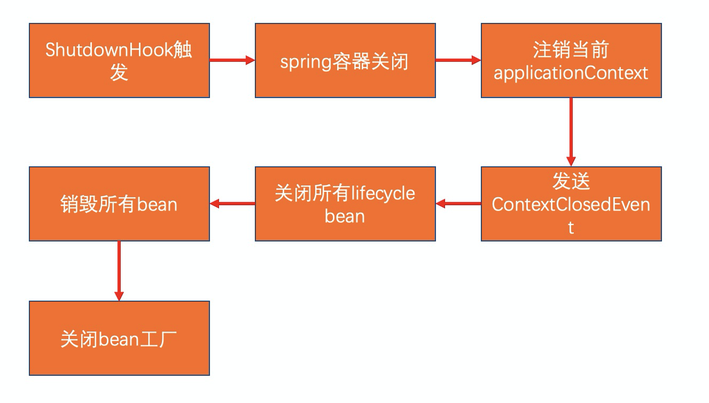

gracefulShutdown
==========

## 简介

实现优雅停机，在关闭web服务前先解决处理中的任务

## 自定义的资源关闭策略

- [GracefulShutdownTaskParam.java](GracefulShutdownTaskParam.java) 自定义的关闭资源对象，包含了
    - id : 任务id，也代表任务添加的先后顺序
    - taskName : 任务名称
    - order : 排序，优先级越高的约优先关闭，同一个优先级的一起关闭
    - asyncClose : 是否异步关闭，同一个优先级的如果存在既有同步、又有异步，则先依次关闭同步，再一次性关闭异步
    - obj : 关闭的对象
    - taskFunction : 要执行的关闭方法
    - build(): 提前写好的两种关闭策略，分别是线程池、线程

- [GracefulShutdownTaskUtil.java](GracefulShutdownTaskUtil.java)
  添加与执行[GracefulShutdownTaskParam.java](GracefulShutdownTaskParam.java)任务，并实现上面所描述的排序执行逻辑

- [GracefulShutdownController.java](GracefulShutdownController.java)
  展示了添加几个自定义关闭策略，并执行的流程，执行日志如下所示：

```
17:05:42.561 [main] INFO com.java.node.web.gracefulShutdown.GracefulShutdownTaskUtil - 优雅停机,添加新任务成功:线程池-1
17:05:42.570 [main] INFO com.java.node.web.gracefulShutdown.GracefulShutdownTaskUtil - 优雅停机,添加新任务成功:线程池-2
17:05:42.571 [main] INFO com.java.node.web.gracefulShutdown.GracefulShutdownTaskUtil - 优雅停机,添加新任务成功:线程-2
17:05:42.571 [main] INFO com.java.node.web.gracefulShutdown.GracefulShutdownTaskUtil - 优雅停机,添加新任务成功:线程-1
17:05:42.572 [main] INFO com.java.node.web.gracefulShutdown.GracefulShutdownTaskUtil - 优雅停机,添加新任务成功:其他任务-1
17:05:42.572 [main] INFO com.java.node.web.gracefulShutdown.GracefulShutdownTaskUtil - 优雅停机,添加新任务成功:其他任务-2
17:05:42.573 [main] INFO com.java.node.web.gracefulShutdown.GracefulShutdownTaskUtil - 优雅停机,添加新任务成功:其他任务-3
17:05:42.574 [main] INFO com.java.node.web.gracefulShutdown.GracefulShutdownTaskUtil - 优雅停机,添加新任务成功:其他任务-4
17:05:42.574 [main] INFO com.java.node.web.gracefulShutdown.GracefulShutdownTaskUtil - 开始执行自定义优雅停机
17:05:42.643 [main] INFO com.java.node.web.gracefulShutdown.GracefulShutdownTaskUtil - 优雅停机,第1批执行任务:["其他任务-3","其他任务-4","其他任务-1","其他任务-2"]
17:05:42.643 [main] INFO com.java.node.web.gracefulShutdown.GracefulShutdownTaskUtil - 优雅停机,第2批执行任务:["线程池-1","线程池-2","线程-2","线程-1"]
17:05:42.643 [main] INFO com.java.node.web.gracefulShutdown.GracefulShutdownTaskUtil - 优雅停机,开始执行任务:其他任务-3
17:05:42.643 [main] INFO com.java.node.web.gracefulShutdown.GracefulShutdownTaskUtil - 优雅停机,任务执行完成:其他任务-3
17:05:42.643 [main] INFO com.java.node.web.gracefulShutdown.GracefulShutdownTaskUtil - 优雅停机,删除任务成功:其他任务-3
17:05:42.643 [main] INFO com.java.node.web.gracefulShutdown.GracefulShutdownTaskUtil - 优雅停机,开始执行任务:其他任务-4
17:05:42.643 [main] INFO com.java.node.web.gracefulShutdown.GracefulShutdownTaskUtil - 优雅停机,任务执行完成:其他任务-4
17:05:42.643 [main] INFO com.java.node.web.gracefulShutdown.GracefulShutdownTaskUtil - 优雅停机,删除任务成功:其他任务-4
17:05:42.653 [ForkJoinPool.commonPool-worker-1] INFO com.java.node.web.gracefulShutdown.GracefulShutdownTaskUtil - 优雅停机,开始执行任务:其他任务-1
17:05:42.653 [ForkJoinPool.commonPool-worker-2] INFO com.java.node.web.gracefulShutdown.GracefulShutdownTaskUtil - 优雅停机,开始执行任务:其他任务-2
17:05:42.653 [ForkJoinPool.commonPool-worker-2] INFO com.java.node.web.gracefulShutdown.GracefulShutdownTaskUtil - 优雅停机,任务执行完成:其他任务-2
17:05:42.653 [ForkJoinPool.commonPool-worker-2] INFO com.java.node.web.gracefulShutdown.GracefulShutdownTaskUtil - 优雅停机,删除任务成功:其他任务-2
17:05:42.761 [ForkJoinPool.commonPool-worker-1] INFO com.java.node.web.gracefulShutdown.GracefulShutdownTaskUtil - 优雅停机,任务执行完成:其他任务-1
17:05:42.761 [ForkJoinPool.commonPool-worker-1] INFO com.java.node.web.gracefulShutdown.GracefulShutdownTaskUtil - 优雅停机,删除任务成功:其他任务-1
17:05:42.761 [ForkJoinPool.commonPool-worker-1] INFO com.java.node.web.gracefulShutdown.GracefulShutdownTaskUtil - 优雅停机,开始执行任务:线程池-1
17:05:42.761 [ForkJoinPool.commonPool-worker-1] INFO com.java.node.web.gracefulShutdown.GracefulShutdownTaskParam - 优雅停机,线程池关闭完成:线程池-1
17:05:42.761 [ForkJoinPool.commonPool-worker-1] INFO com.java.node.web.gracefulShutdown.GracefulShutdownTaskUtil - 优雅停机,任务执行完成:线程池-1
17:05:42.761 [ForkJoinPool.commonPool-worker-1] INFO com.java.node.web.gracefulShutdown.GracefulShutdownTaskUtil - 优雅停机,删除任务成功:线程池-1
17:05:42.761 [ForkJoinPool.commonPool-worker-2] INFO com.java.node.web.gracefulShutdown.GracefulShutdownTaskUtil - 优雅停机,开始执行任务:线程池-2
17:05:42.762 [ForkJoinPool.commonPool-worker-2] INFO com.java.node.web.gracefulShutdown.GracefulShutdownTaskParam - 优雅停机,线程池关闭完成:线程池-2
17:05:42.762 [ForkJoinPool.commonPool-worker-1] INFO com.java.node.web.gracefulShutdown.GracefulShutdownTaskUtil - 优雅停机,开始执行任务:线程-2
17:05:42.762 [ForkJoinPool.commonPool-worker-3] INFO com.java.node.web.gracefulShutdown.GracefulShutdownTaskUtil - 优雅停机,开始执行任务:线程-1
17:05:42.762 [ForkJoinPool.commonPool-worker-2] INFO com.java.node.web.gracefulShutdown.GracefulShutdownTaskUtil - 优雅停机,任务执行完成:线程池-2
17:05:42.762 [ForkJoinPool.commonPool-worker-1] INFO com.java.node.web.gracefulShutdown.GracefulShutdownTaskParam - 优雅停机,线程已完成:线程-2,跳过
17:05:42.762 [ForkJoinPool.commonPool-worker-2] INFO com.java.node.web.gracefulShutdown.GracefulShutdownTaskUtil - 优雅停机,删除任务成功:线程池-2
17:05:42.762 [ForkJoinPool.commonPool-worker-1] INFO com.java.node.web.gracefulShutdown.GracefulShutdownTaskUtil - 优雅停机,任务执行完成:线程-2
17:05:42.762 [ForkJoinPool.commonPool-worker-1] INFO com.java.node.web.gracefulShutdown.GracefulShutdownTaskUtil - 优雅停机,删除任务成功:线程-2
17:05:42.762 [ForkJoinPool.commonPool-worker-3] INFO com.java.node.web.gracefulShutdown.GracefulShutdownTaskParam - 优雅停机,线程已完成:线程-1,跳过
17:05:42.762 [ForkJoinPool.commonPool-worker-3] INFO com.java.node.web.gracefulShutdown.GracefulShutdownTaskUtil - 优雅停机,任务执行完成:线程-1
17:05:42.762 [ForkJoinPool.commonPool-worker-3] INFO com.java.node.web.gracefulShutdown.GracefulShutdownTaskUtil - 优雅停机,删除任务成功:线程-1

```

###  

## 监测停机事件的方式与优先级,并通过这些方法触发关闭策略

### tomcat的优雅停机

tomcat自带的优雅停机
配置方式:

```properties
#开启优雅停机
server.shutdown=graceful
#最多等待1s，默认30s
spring.lifecycle.timeout-per-shutdown-phase=1s
```

### @PreDestroy注解方式

直接加注解即可，与 @PostConstruct 使用一样

### 实现 ApplicationListener

见 [CustomGracefulShutdown.java](CustomGracefulShutdown.java)

### 添加 ShutdownHook

见 [CustomGracefulShutdown.java](CustomGracefulShutdown.java)，注意执行起来为异步的,因此可能服务进程都关闭了，此方法还没有执行完成

### 实现 DisposableBean 接口

见 [MyDisposableBean.java](MyDisposableBean.java)

### 实现 Closeable

见 [CloseableImpl.java](CloseableImpl.java)

### 实测执行先后顺序

ShutdownHook(异步执行) > ApplicationListener > tomcat graceful shutdown > DisposableBean > @PreDestroy > Closeable



### 执行日志

```
17:10:38.831+08:00  INFO 26868 --- [       Thread-1] c.j.n.w.g.CustomGracefulShutdown         : 检测到进程退出,执行自定义优雅停机,检测方式:ShutdownHook
17:10:38.833+08:00  INFO 26868 --- [ionShutdownHook] c.j.n.w.g.CustomGracefulShutdown         : 检测到进程退出,执行自定义优雅停机,检测方式:ApplicationListener<ContextClosedEvent>
17:10:39.346+08:00  INFO 26868 --- [ionShutdownHook] c.j.n.w.g.CustomGracefulShutdown         : 执行结束
17:10:39.348+08:00  INFO 26868 --- [ionShutdownHook] o.s.b.w.e.tomcat.GracefulShutdown        : Commencing graceful shutdown. Waiting for active requests to complete
17:10:39.362+08:00  INFO 26868 --- [tomcat-shutdown] o.s.b.w.e.tomcat.GracefulShutdown        : Graceful shutdown complete
17:10:39.371+08:00  INFO 26868 --- [ionShutdownHook] c.j.n.w.g.MyDisposableBean               : 检测到进程退出,执行自定义优雅停机,检测方式:DisposableBean
17:10:39.580+08:00  INFO 26868 --- [ionShutdownHook] c.j.n.w.g.MyDisposableBean               : 执行结束
17:10:39.581+08:00  INFO 26868 --- [ionShutdownHook] c.j.n.w.g.CustomGracefulShutdown         : 检测到进程退出,执行自定义优雅停机,检测方式:@PreDestroy
17:10:40.093+08:00  INFO 26868 --- [ionShutdownHook] c.j.n.w.g.CustomGracefulShutdown         : 执行结束
17:10:40.094+08:00  INFO 26868 --- [ionShutdownHook] c.j.n.w.gracefulShutdown.CloseableImpl   : 检测到进程退出,执行自定义优雅停机,检测方式:Closeable
17:10:40.299+08:00  INFO 26868 --- [ionShutdownHook] c.j.n.w.gracefulShutdown.CloseableImpl   : 执行结束
```